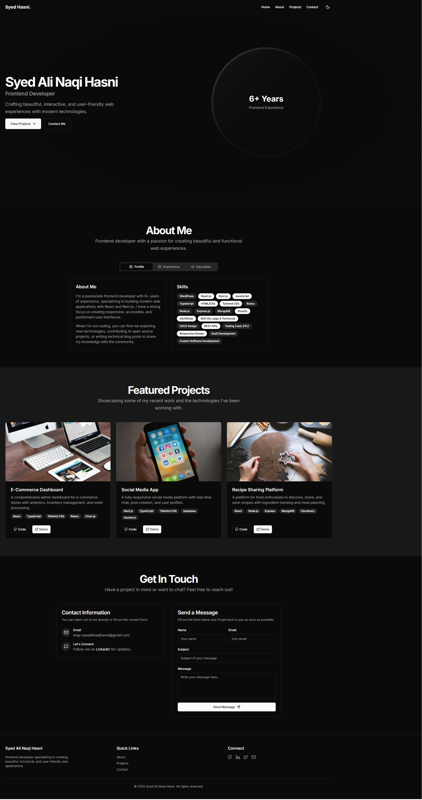

# 🚀 Next.js Developer Portfolio with Radix UI + Sanity CMS

A sleek, modern, and customizable developer portfolio built with **Next.js (App Router)**, powered by **Sanity.io** as a headless CMS, and styled beautifully using **Radix UI** components built on top of **Tailwind CSS**.

---

## 📸 Preview



---

## 🧰 Tech Stack

- **Framework:** [Next.js](https://nextjs.org/)
- **CMS:** [Sanity.io](https://www.sanity.io/)
- **UI Library:** [Radix UI](https://www.radix-ui.com/)
- **CSS:** [Tailwind CSS](https://tailwindcss.com/)
- **Hosting:** Vercel / Netlify / Custom

---

## 📁 Folder Structure

```
.
├── app/                         # App Router pages
│   └── page.tsx                # Homepage
├── components/                 # Reusable components (Hero, Navbar, etc.)
├── hooks/                      # Custom Hooks
├── lib/
│   └── sanity.ts               # Sanity client configuration
├── public/                     # Public assets (images, favicon)
├── styles/                     # Tailwind & global CSS
├── .env.local                  # Environment variables
├── next.config.js              # Next.js config
├── tailwind.config.js          # Tailwind CSS config
├── sanity.config.js            # Sanity config file
├── postcss.config.js
└── README.md
```

---

## 🔌 Sanity Setup

1. **Install the Sanity CLI globally** (if not already installed):

```bash
npm install -g sanity
```

2. **Initialize your Sanity project**:

```bash
sanity init
```

- Choose your project name
- Select your dataset name (default: `production`)
- Choose the "Clean Project with Schema" template
- Link it to a Sanity.io account (create one if needed)

3. **Add these keys to your `.env.local` file in your Next.js app**:

```env
NEXT_PUBLIC_SANITY_PROJECT_ID=your_project_id
NEXT_PUBLIC_SANITY_DATASET=production
```

4. **Deploy your studio** (optional but recommended):

```bash
sanity deploy
```

Then you'll get a hosted Studio URL to manage your content.

---

## ✍️ Sanity Client (lib/sanity.ts)

```ts
import { createClient } from 'next-sanity';

export const client = createClient({
  projectId: process.env.NEXT_PUBLIC_SANITY_PROJECT_ID || 'SANITY_PROJECT_ID',
  dataset: process.env.NEXT_PUBLIC_SANITY_DATASET || 'production',
  apiVersion: '2023-05-03',
  useCdn: process.env.NODE_ENV === 'production',
});
```

---

## 🛠️ Getting Started (Next.js App)

1. **Clone the repository**

```bash
git clone https://github.com/yourusername/nextjs-sanity-portfolio.git
cd nextjs-sanity-portfolio
```

2. **Install dependencies**

```bash
npm install
# or
yarn
```

3. **Add environment variables**

Create a `.env.local` file:

```bash
NEXT_PUBLIC_SANITY_PROJECT_ID=your_project_id
NEXT_PUBLIC_SANITY_DATASET=production
```

4. **Run development server**

```bash
npm run dev
# or
yarn dev
```

Visit: [http://localhost:3000](http://localhost:3000)

---

## 🧱 Features

- 🔥 Fully dynamic content from Sanity
- 🌈 Radix components for rapid UI development
- 🧩 Customizable and scalable folder structure
- ⚡ Optimized for performance and SEO

---

## 📦 Build for Production

```bash
npm run build
npm start
```

---

## 🧠 Learn More

- [Next.js Documentation](https://nextjs.org/docs)
- [Sanity.io Docs](https://www.sanity.io/docs)
- [Radix UI Docs](https://www.radix-ui.com/themes/docs)
- [Tailwind CSS Docs](https://tailwindcss.com/docs)

---

## ✨ Author

**Syed Ali Naqi Hasni**  
🔗 [GitHub](https://github.com/syedalinaqihasni) | [LinkedIn](https://linkedin.com/in/SyedAliNaqiHasni) | [Twitter (X)](https://x.com/SyedHasni1997)

---

## 🪪 License

This project is open source under the [MIT License](./LICENSE).
